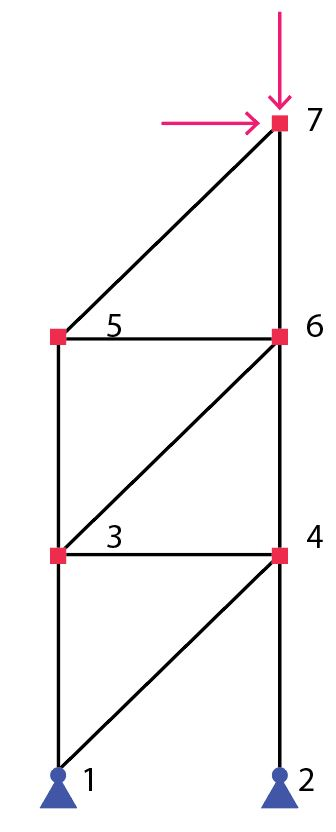

Truss Area Optimizations
===================

In the following example, the areas of a truss member are optimzied to mimize displacements under several different conditions.
The truss in the example has a fixed layout, where the nodes locations and element connectivies are pre-defined, as defined in the image below
Force is defined at the top node of the model.

The genes for the problem is the area of each truss in the model

