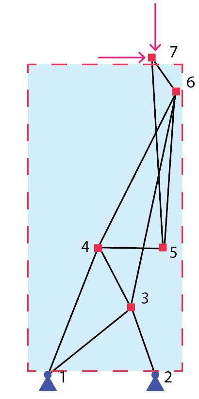

Truss Area Optimizations
===================

In the following example, the node locations of a truss member are optimzied to mimize displacements when lateral loads are applied.
The truss in the example has a fixed layout, where the element connectivies are pre-defined, as defined in the image below.
Three boundary nodes are defined that will have a fixed position. The bottom two nodes are fixed, and the top node will have forces applied to it.

The the problem is definied using two genes: the x and y position of each node.

